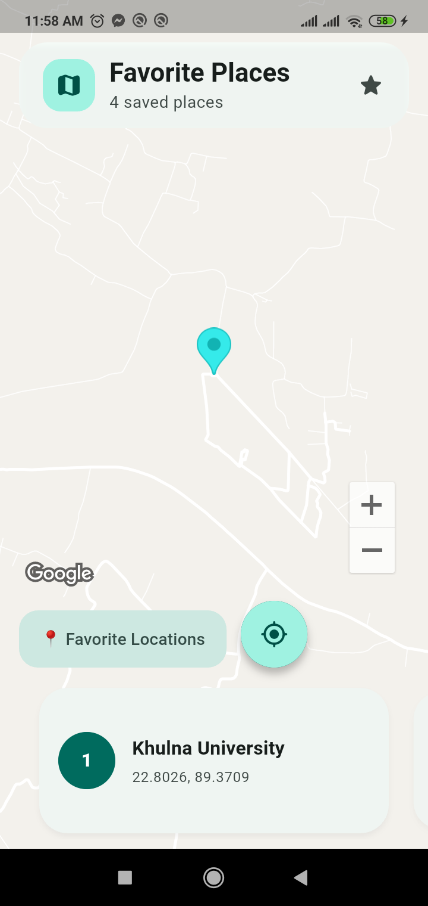
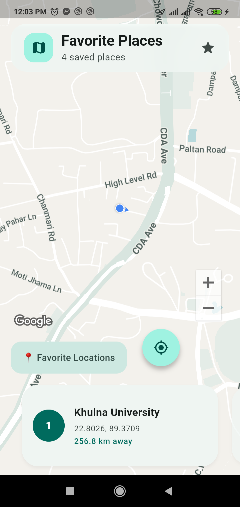
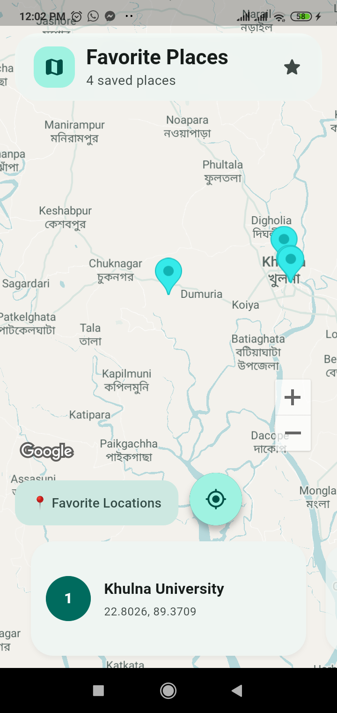
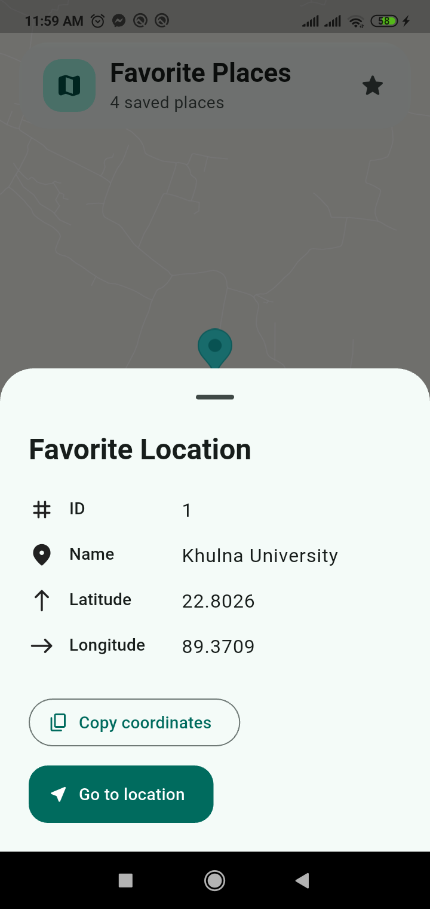
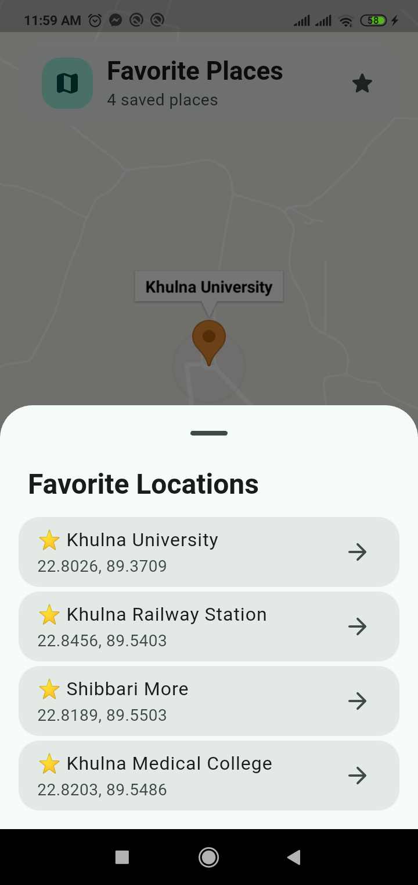

# FavMap

FavMap is a polished Flutter application that displays Google Maps, shows four predefined favorite locations in Khulna, and obtains the user's current position from the device location service. Users can select places from map markers, a synchronized card carousel, or a favorite-locations list.

The project uses null-safe Dart, Material 3, Provider with `ChangeNotifier`, `google_maps_flutter`, and `geolocator`.

## Assignment requirements

| Requirement | Implementation |
| --- | --- |
| Display Google Maps on startup | A full-screen `GoogleMap` is created in [`lib/screens/map_screen.dart`](lib/screens/map_screen.dart). |
| Show zoom controls | Native Google Maps zoom controls are enabled. |
| Show the user's current location | The custom **My Location** button requests the device position, enables the blue location dot, and moves the camera to the returned coordinates. |
| Do not hard-code the current location | Current coordinates come from `Geolocator.getCurrentPosition`; only favorite locations are predefined. |
| Handle location permission | Service-disabled, denied, permanently denied, timeout, and general failure states have dedicated UI responses. Permission is never requested until the user presses **My Location**. |
| Define a favorite-location model | [`FavoriteLocation`](lib/models/favorite_location.dart) contains immutable `id`, `name`, `latitude`, and `longitude` fields. |
| Include at least three favorite locations | Four favorite locations are defined in [`lib/data/favorite_locations_data.dart`](lib/data/favorite_locations_data.dart). |
| Display favorite markers | Every favorite is rendered as a map marker. The selected marker uses a distinct color and animated pulse. |
| Show details when a marker is tapped | A bottom sheet displays the location ID, name, latitude, and longitude, with copy and camera actions. |
| Provide a favorite-location list | The **📍 Favorite Locations** button opens a staggered list. Selecting an item closes the sheet, moves the camera, and opens the marker info window. |

## Favorite locations

| ID | Name | Latitude | Longitude |
| ---: | --- | ---: | ---: |
| 1 | Khulna University | 22.8026 | 89.3709 |
| 2 | Khulna Railway Station | 22.8456 | 89.5403 |
| 3 | Shibbari More | 22.8189 | 89.5503 |
| 4 | Khulna Medical College | 22.8203 | 89.5486 |

## User flow

### Current location

```text
Tap My Location
        ↓
Check location service and permission
        ↓
Read latitude and longitude from the device
        ↓
Enable the Google Maps blue location dot
        ↓
Animate the camera to the user at zoom 16
```

### Favorite selection

```text
Marker tap / carousel swipe / card tap / list selection
        ↓
PlacesProvider updates the selected favorite ID
        ↓
MapProvider moves the camera and opens the info window
        ↓
Markers, pulse, carousel, and sheets reflect the same selection
```

## Additional product polish

- Material 3 light and dark themes that follow the system setting.
- Muted light and dark Google Maps styles.
- Animated launch header and bottom carousel.
- Two-way marker and carousel synchronization without feedback loops.
- Selected-marker pulse throttled to approximately 30 frames per second.
- Animated details and favorite-list bottom sheets.
- Distance from the user to each favorite when the current position is known.
- Haptic feedback, floating SnackBars, accessible labels, tooltips, and 48×48 minimum button targets.
- Responsive controls for small screens and landscape layouts.
- Reduced-motion support through the platform accessibility preference.

## Architecture

The app separates platform access, business state, and UI:

- `LocationService` abstracts geolocator so location behavior is unit-testable.
- `PlacesProvider` owns the immutable favorite list and the selected location ID.
- `LocationProvider` owns permission, current-position, blue-dot, distance, and status state.
- `MapProvider` owns the Google Maps controller and camera operations.
- Widgets keep only short-lived UI state such as animation and page controllers.
- Providers never store `BuildContext` and never display dialogs or SnackBars.

All providers are registered with `MultiProvider` in [`lib/main.dart`](lib/main.dart). Widgets use selective Provider reads to avoid unnecessary full-screen rebuilds.

## Project structure

```text
lib/
├── data/                  # Predefined favorite locations
├── models/                # Immutable FavoriteLocation model
├── providers/             # Places, location, and map state
├── screens/               # Full-screen map composition
├── services/              # Testable geolocator abstraction
├── theme/                 # Material 3 light and dark themes
├── utils/                 # Map styles and SnackBar helpers
└── widgets/               # Header, carousel, buttons, and sheets

test/
├── favorite_location_test.dart
├── location_provider_test.dart
└── places_provider_test.dart
```

## Setup

### Prerequisites

- Flutter SDK compatible with Dart `^3.13.3`.
- Android Studio or VS Code with Flutter support.
- An Android emulator/device with Google Play services, or a physical iOS device/simulator on macOS.
- A Google Cloud project with billing configured as required by Google Maps Platform.

Check the local Flutter installation:

```shell
flutter doctor
flutter pub get
```

### 1. Enable Google Maps APIs

In [Google Cloud Console](https://console.cloud.google.com/):

1. Create or select a project.
2. Open **APIs & Services → Library**.
3. Enable **Maps SDK for Android**.
4. Enable **Maps SDK for iOS** when evaluating on iOS.
5. Open **APIs & Services → Credentials** and create an API key.
6. Restrict the key before publishing:
   - Android package name: `com.ostad.favmap.favmap`
   - iOS bundle identifier: `com.ostad.favmap.favmap`

Using separate restricted keys for Android and iOS is recommended for a published application. The local secret files accept whichever platform-specific key is appropriate.

### 2. Configure the Android key

Create the ignored file from its committed template.

PowerShell:

```powershell
Copy-Item android/secrets.properties.example android/secrets.properties
```

macOS/Linux:

```shell
cp android/secrets.properties.example android/secrets.properties
```

Open `android/secrets.properties` and replace the placeholder:

```properties
MAPS_API_KEY=YOUR_REAL_ANDROID_MAPS_API_KEY
```

### 3. Configure the iOS key

Create the ignored file from its committed template.

PowerShell:

```powershell
Copy-Item ios/Flutter/Secrets.xcconfig.example ios/Flutter/Secrets.xcconfig
```

macOS/Linux:

```shell
cp ios/Flutter/Secrets.xcconfig.example ios/Flutter/Secrets.xcconfig
```

Open `ios/Flutter/Secrets.xcconfig` and replace the placeholder:

```text
MAPS_API_KEY=YOUR_REAL_IOS_MAPS_API_KEY
```

Both real secret files are excluded by `.gitignore`; only their placeholder templates are committed.

### 4. Run the application

Connect or start a device, then run:

```shell
flutter pub get
flutter run
```

When **My Location** is pressed, grant the location permission. For an emulator, configure a simulated GPS location so geolocator can return coordinates.

## Verification

Run the same checks used during development:

```shell
dart format --output=none --set-exit-if-changed .
flutter analyze
flutter test
flutter build apk --debug
```

The unit tests cover:

- Favorite-location field storage, unique IDs, and coordinate ranges.
- Place selection, notification counts, clearing, and unknown IDs.
- Location success, service disabled, permission denied, permission denied forever, timeout, generic error, and silent permission checks.

## Submission screenshots

The screenshots must be captured from a running device or emulator after installing a valid Google Maps API key. Save them with these exact paths so GitHub displays them below.

### Google Map at startup



### Current device location



### Favorite markers



### Favorite location details



### Favorite locations list



## Evaluation checklist

- [x] Google Map loads at application startup.
- [x] Zoom controls and a custom current-location button are available.
- [x] Four favorite-location markers are shown.
- [x] Current location comes from the device through geolocator.
- [x] Location-service and permission failures are handled.
- [x] Marker taps show ID, name, latitude, and longitude.
- [x] The favorite list moves the map to the selected place.
- [x] Model and providers have automated unit tests.
- [x] Android and iOS API keys are read from ignored secret files.
- [ ] Capture and commit the required screenshots before submission.
